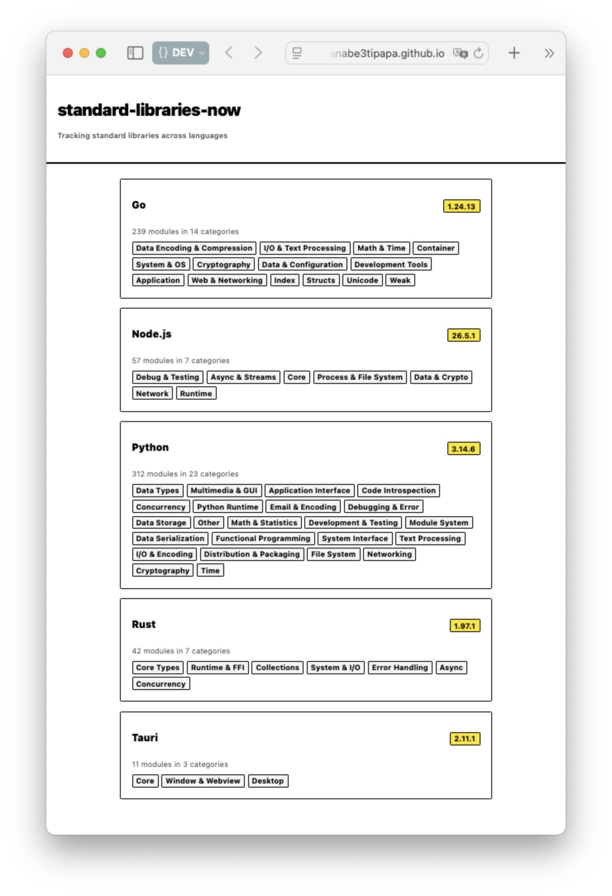

[](https://github.com/watanabe3tipapa/standard-libraries-now)

<!-- badges -->
[](https://github.com/watanabe3tipapa/standard-libraries-now/deployments)

[English](README.md) | [日本語](README_ja.md)

# standard-libraries-now

A daily-updated index of standard libraries for Node.js, Python, Rust, Go, and Tauri. The data is crawled automatically every morning and published as a static site.

Live site: <https://watanabe3tipapa.github.io/standard-libraries-now/>

## Features

- **Daily crawling** — GitHub Actions runs at 5:00 JST and refreshes the library data automatically
- **5 languages, 672 modules** — Node.js / Python / Rust / Go / Tauri
- **Single-page drill-down UI** — expand language → category → module, built purely with native HTML `<details>` / `<summary>` (no JavaScript)
- **Neo Brutalism design** — flat cards, thick black borders, and neon accents

## Screenshot



## Installation

```bash
# Clone the repository
git clone https://github.com/watanabe3tipapa/standard-libraries-now.git

# Install crawler dependencies
cd crawler
npm install

# Install site dependencies
cd ../site
npm install
```

## Usage

From the repository root:

```bash
# Full pipeline (crawl + build)
npm run run

# Crawl all languages only
npm run crawl

# Build the static site only
npm run build
```

## Contributing

Contributions are welcome!

1. Fork the repository
2. Create your feature branch (`git checkout -b feature/amazing-feature`)
3. Commit your changes (`git commit -m 'Add amazing feature'`)
4. Push to the branch (`git push origin feature/amazing-feature`)
5. Open a Pull Request

## License

License not yet specified.

## Contact

GitHub: [https://github.com/watanabe3tipapa/standard-libraries-now](https://github.com/watanabe3tipapa/standard-libraries-now)
